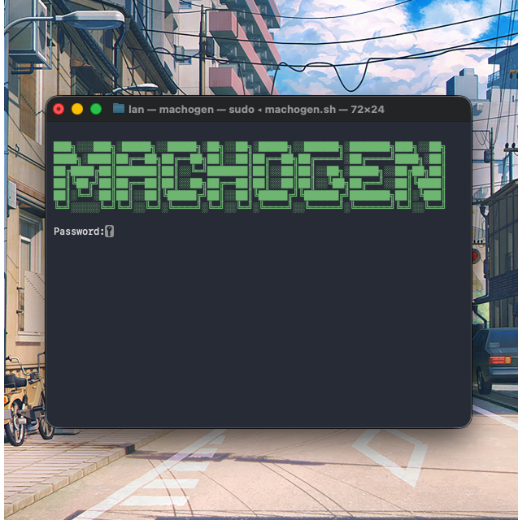
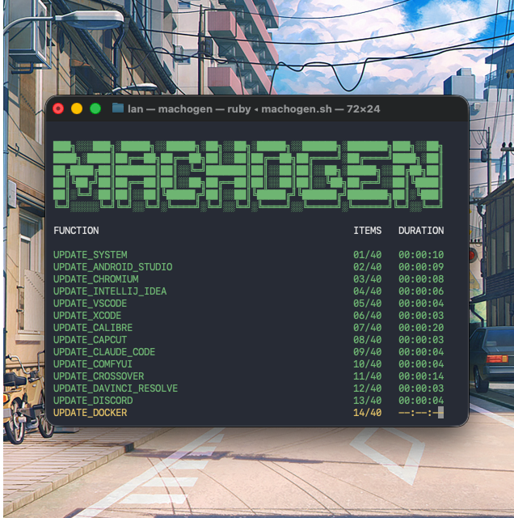

<hr>

# OVERVIEW

Post-installation script to set up a whole developer-friendly environment on macOS. It installs, updates, and configures every single software on your machine automatically. This is highly opinionated with harsh defaults and shouldn't be executed blindly. It intentionally uses Ungoogled Chromium as the main browser and has advanced mechanisms to install official and unofficial extensions Yeah, the best extensions are not on the store and the best features are not available on official Chrome or shit-tier forks. Ungoogled Chromium is also used for development purposes with a specific Developer profile. This profile has to be used when debugging with your code editors.

<hr>

# PREVIEWS



<hr>

# FEATURES

- Update System
- Update Android Cmdline
- Update Android Studio
- Update Calibre
- Update CapCut
- Update Chromium (Ungoogled)
- Update Claude Code
- Update ComfyUI
- Update Conductor
- Update CrossOver
- Update Cursor
- Update DaVinci Resolve
- Update Discord
- Update Docker
- Update Figma
- Update Flutter
- Update Fork
- Update Frame0
- Update Git
- Update Google Chrome
- Update Hoppscotch
- Update IBKR Desktop
- Update IINA
- Update Icon Composer
- Update IntelliJ IDEA Ultimate
- Update JDownloader
- Update Joal Desktop
- Update KeepingYouAwake
- Update Keka
- Update Miniforge
- Update MQTTX
- Update MPV
- Update NetNewsWire
- Update Nightlight
- Update Node.js
- Update Notion
- Update OBS
- Update Pearcleaner
- Update PostgreSQL
- Update Telegram
- Update Temurin
- Update TradingView
- Update Transmission
- Update UTM
- Update Visual Studio Code
- Update Xcode
- Update YouTube Music
- Update Angular DevTools
- Update Android DevTools
- Update Apple DevTools
- Update Flutter DevTools
- Update Git DevTools
- Update Ionic DevTools
- Update React DevTools
- Update React Native DevTools
- Update Shell DevTools
- Update Spring DevTools
- Update Appearance

<hr>

# GUIDANCE

### Launch Script

```shell
/bin/zsh -c "$(curl -fsL https://raw.githubusercontent.com/olankens/machogen/HEAD/src/machogen.sh)"
```

### Import Functions

```shell
source <(curl -fsL https://raw.githubusercontent.com/olankens/machogen/HEAD/src/machogen.sh)
update_android_devtools
update_angular_devtools
```

<hr>
