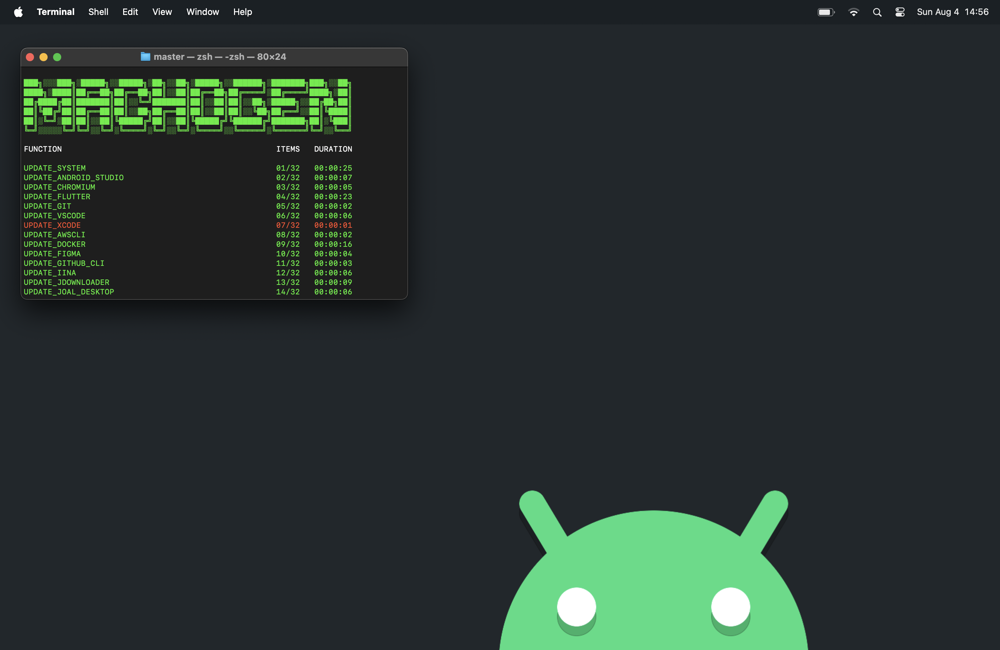
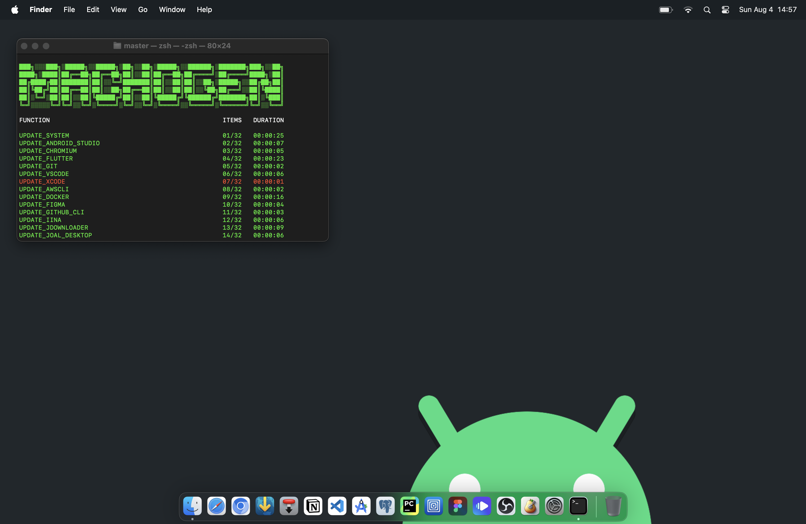

# <samp>OVERVIEW</samp>

MacOS automatic setup for developers.



# <samp>FEATURES</samp>

- Update System
- Update Android Studio
- Update AWS CLI
- Update Calibre
- Update Chromium
- Update Docker
- Update Figma
- Update Git
- Update GitHub CLI
- Update IntelliJ IDEA Ultimate
- Update JDownloader
- Update Joal Desktop
- Update KeepingYouAwake
- Update Kubernetes
- Update Miniforge
- Update Mpv
- Update Nightlight
- Update Node
- Update Notion
- Update OBS
- Update Pearcleaner
- Update PostgreSQL
- Update Temurin
- Update The Unarchiver
- Update Transmission
- Update UTM
- Update Vesktop
- Update Visual Studio Code
- Update Whisky
- Update Xcode
- Update Youtube Music
- Update Android DevTools
- Update Angular DevTools
- Update iOS DevTools
- Update React DevTools
- Update React Native DevTools
- Update Spring DevTools
- Update Appearance

# <samp>GUIDANCE</samp>

### Launch the script

Blindly executing this is strongly discouraged.

```shell
/bin/zsh -c "$(curl -fsSL https://raw.githubusercontent.com/olankens/machogen/HEAD/src/machogen.sh)"
```

### Import the functions

Invoke specific functions only.

```shell
source <(curl -fsSL https://raw.githubusercontent.com/olankens/machogen/HEAD/src/machogen.sh)
update_android_devtools
update_react_native_devtools
update_spring_devtools
```
