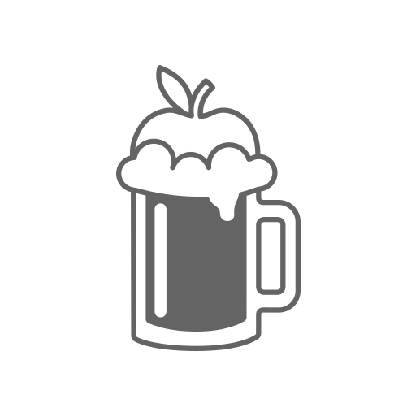

<div align="center">
  <p></p>
  <h1><code>MACHOGEN</code></h1>
</div>

<table>
  <tbody><tr><td align="center" width="99999"><div>
    <a href="https://olankens.com">WEBSITE</a> ·
    <a href="https://ko-fi.com/olankens">FUNDING</a>
  </div></td></tr></tbody>
  <tbody><tr><td align="center" width="99999">&nbsp;<div>
    Configure your macOS machine automatically with this highly opinionated post-installation script. Update and install all necessary development tools and apply strict defaults without manual intervention.
  </div>&nbsp;</td></tr></tbody>
  <tbody><tr><td align="center" width="99999">
    <a href="https://www.apple.com/os/macos"></a>
    <picture></picture>
    <a href="https://brew.sh"></a>
    <picture></picture>
    <a href="https://wikipedia.org/wiki/Bash_(Unix_shell)"></a>
  </td></tr></tbody>
</table>

## PREVIEWS

<table><tbody><tr><td width="99999">
  <picture></picture>
</td></tr></tbody></table>

## FEATURES

<table>
  <tbody><tr><td width="99999">Bootstraps Homebrew with shellenv in .zprofile, zsh-autosuggestions in .zshrc, Rosetta 2, Xcode license, verified Accessibility and Disk Access, caffeinate plus NOPASSWD sudo for unattended runs.</td><td>✅</td></tr></tbody>
  <tbody><tr><td>Applies strict macOS defaults: computer names via scutil, Brussels timezone, muted boot chime, dark mode, tint-free wallpaper, autohiding Dock, curated layout, wallpaper and custom app icons.</td><td>✅</td></tr></tbody>
  <tbody><tr><td>Installs Ungoogled Chromium as default browser via defaultbrowser, scripted first-launch setup with custom NTP, download folder, dark mode, plus web-store bridge, uBlock, Bitwarden and extras.</td><td>✅</td></tr></tbody>
  <tbody><tr><td>Provisions Java Temurin, Node LTS with pnpm, Miniforge conda for zsh, PowerShell telemetry-free, Android SDK with Pixel 7a emulator, Xcode via xcodes, Flutter precached, Docker with Colima VM.</td><td>✅</td></tr></tbody>
  <tbody><tr><td>Installs IntelliJ IDEA, Android Studio and VS Code with first-launch automation, Islands Dark theme, JetBrains Mono font, format on save, dotenv, Error Lens, spell checker and tuned telemetry.</td><td>✅</td></tr></tbody>
  <tbody><tr><td>Sets up JS/TS with Biome, ESLint, Prettier, Angular and Astro, Spring Boot with Initializr and containers, KMM plugins, NestJS CLI, plus ShellCheck, shfmt and Bash IDE tooling for scripts.</td><td>✅</td></tr></tbody>
  <tbody><tr><td>Installs Claude Code globally with onboarding skipped, higher token ceiling and no trailers, Headroom context manager via uv, VS Code extension plus claude-agent-acp bridge for JetBrains editors.</td><td>✅</td></tr></tbody>
  <tbody><tr><td>Adds everyday apps: Figma, Orca, UTM, Calibre with plugins, Notion silenced, JDownloader and Transmission tuned, Keka with Mole, KeepingYouAwake plus Nightlight scheduled at sixty percent.</td><td>✅</td></tr></tbody>
</table>

## LEARNING

### LAUNCH SCRIPT

```sh
/bin/zsh -c "$(curl -fsL https://github.com/olankens/machogen/releases/latest/download/machogen.sh)"
```

### IMPORT FUNCTIONS

```sh
source <(curl -fsL https://github.com/olankens/machogen/releases/latest/download/machogen.sh)
```
