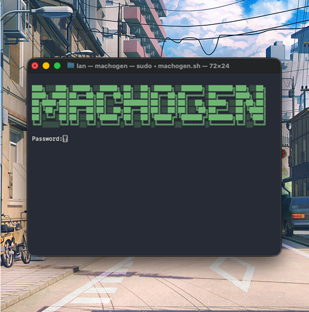
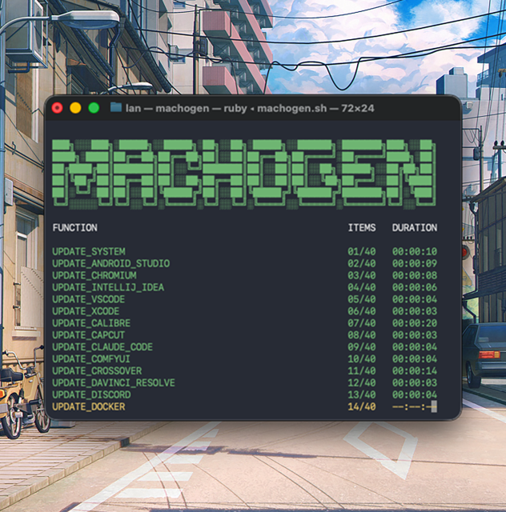

<hr>

# OVERVIEW

Post-installation script to set up a whole developer-friendly environment on macOS. It installs, updates, and configures every single software on your machine automatically. This is highly opinionated with harsh defaults and shouldn't be executed blindly. It intentionally uses Ungoogled Chromium as the main browser and has advanced mechanisms to install official and unofficial extensions. Yeah, the best extensions are not on the store and the best features are not available on official Chrome or shit-tier forks. Ungoogled Chromium is also used for development purposes with a specific Developer profile. This profile has to be used when debugging with your code editors.

<hr>

### Handling Password

Lorem ipsum dolor sit amet, consectetur adipiscing elit. Nullam pretium, ipsum et blandit sollicitudin, massa velit semper odio, sed convallis arcu urna quis mi. Nunc hendrerit rhoncus elit in.



<hr>

### Handling Security

Lorem ipsum dolor sit amet, consectetur adipiscing elit. Nullam pretium, ipsum et blandit sollicitudin, massa velit semper odio, sed convallis arcu urna quis mi. Nunc hendrerit rhoncus elit in.


<hr>

### Handling Apple ID

Lorem ipsum dolor sit amet, consectetur adipiscing elit. Nullam pretium, ipsum et blandit sollicitudin, massa velit semper odio, sed convallis arcu urna quis mi. Nunc hendrerit rhoncus elit in.


<hr>

### Updating System

Lorem ipsum dolor sit amet, consectetur adipiscing elit. Nullam pretium, ipsum et blandit sollicitudin, massa velit semper odio, sed convallis arcu urna quis mi. Nunc hendrerit rhoncus elit in.

<hr>

### Updating Applications

Lorem ipsum dolor sit amet, consectetur adipiscing elit. Nullam pretium, ipsum et blandit sollicitudin, massa velit semper odio, sed convallis arcu urna quis mi. Nunc hendrerit rhoncus elit in.

<hr>

### Updating DevTools

Lorem ipsum dolor sit amet, consectetur adipiscing elit. Nullam pretium, ipsum et blandit sollicitudin, massa velit semper odio, sed convallis arcu urna quis mi. Nunc hendrerit rhoncus elit in.

<hr>

### Updating Appearance

Lorem ipsum dolor sit amet, consectetur adipiscing elit. Nullam pretium, ipsum et blandit sollicitudin, massa velit semper odio, sed convallis arcu urna quis mi. Nunc hendrerit rhoncus elit in.

<hr>

# GUIDANCE

### Script Usage

Lorem ipsum dolor sit amet consectetur.

```shell
/bin/zsh -c "$(curl -fsL https://raw.githubusercontent.com/olankens/machogen/HEAD/src/machogen.sh)"
```

<hr>

### Library Usage

Lorem ipsum dolor sit amet consectetur.

```shell
source <(curl -fsL https://raw.githubusercontent.com/olankens/machogen/HEAD/src/machogen.sh)
update_android_devtools
update_angular_devtools
```

<hr>
